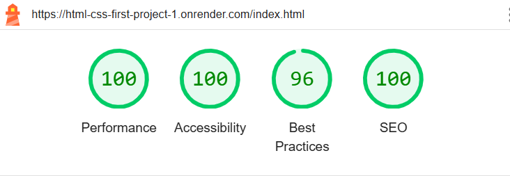

# Myndighetssida – Skolprojekt

Detta är mitt första projekt på Javascript utbildningen. Webbplatsen är en **låtsassida för en myndighet** där användaren kan hitta information och boka tid via en enkel e-ansökningssida.

LIVE: https://html-css-first-project-1.onrender.com
(Iconer kan laddas senare, testa ladda om sidan eller navigera i sidan.)

---

## Funktioner

- Tre tillgängliga sidor med grundläggande navigering.
- Länkar som fungerar:
  - **Logga in**
  - **Boka tid nu**
  - **Hemsidans logotyp**
- Vissa knappar är medvetet inaktiva och fungerar endast som visuella element.

---

## Teknik och implementation

- **Endast HTML och CSS** – inga ramverk, JavaScript eller externa bibliotek (t.ex. ikoner eller API:er).
- **Flexbox** används för layout.
- **Färgpalett med hög kontrast** för att uppfylla **WCAG AA-kraven**.
- Validerad i **W3C:s tjänster** för både HTML och CSS (inga fel).
- **Responsiv design**:
  - Webbplatsen och bilderna anpassar sig till olika skärmstorlekar.
  - Under **610px används inga bilder**, inspirerat av hur flera statliga webbplatser hanterar mobila vyer.

---

## Design

Färger och layout planerades i Figma:

---

## SEO

Grundläggande **SEO-optimeringar** implementerades och gav goda resultat.

---

## Sammanfattning

Projektet visar hur man kan bygga en **tillgänglig och responsiv webbplats** med fokus på enkelhet, färgkontrast och struktur – utan externa ramverk eller bibliotek.
